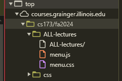
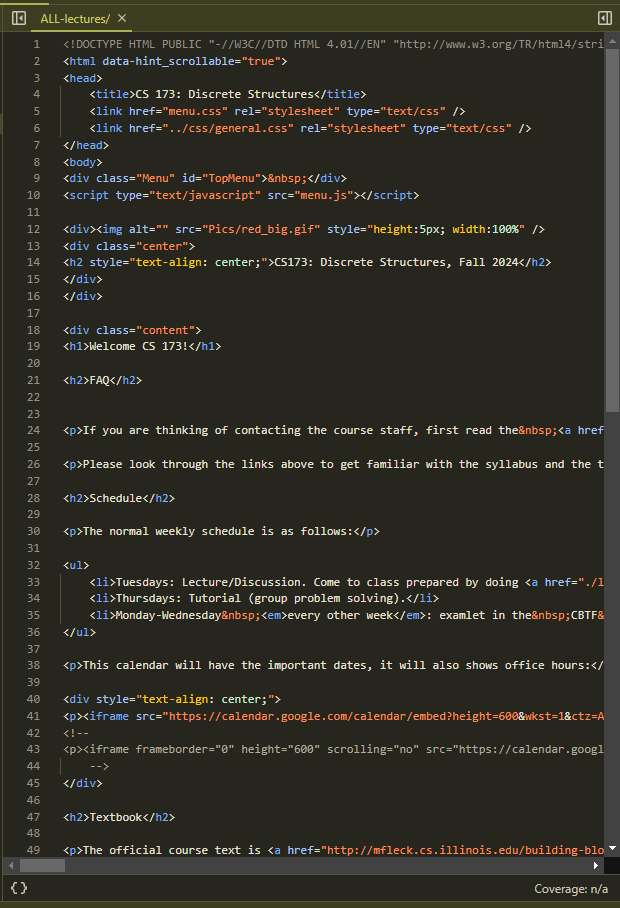

# Part 1: Inspecting the Web
I examined the course website for CS 173, a class that makes me want to cry at times.

[Link to the website](https://courses.grainger.illinois.edu/cs173/)

---

### **What web technologies (that is HTML, CSS, or JavaScript) were used to build the tool? Are there files that end in .html, .css, or .js?**

I found the trio of files that are typical for any website, the .html, .css, and .js files. I wonder why Inspect Element doesn't show the .html extension?

### **What about files you don’t recognize?**

I'm a little confused as to why there needs to be 2 .css files? I thought css is just for styling the page, so why is it split up into 2?

### **Who built this website? How many people were involved? How can you tell?**

I tried looking around inside Inspect Element, and even tried Googling for a repository for the site, but I could find anything.

The closest thing I found was a Github repository another course website under the same subdomain of grainger.illinois.edu. It was [the repository](https://github.com/0xSK/ece101-website) for the course site for [ECE 101](https://courses.grainger.illinois.edu/ece101).